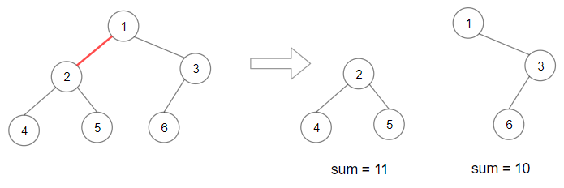
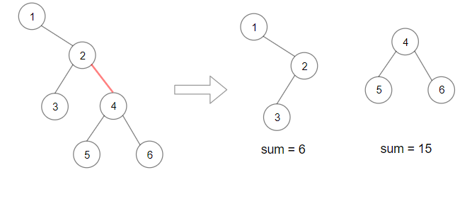

== maximum-product-of-splitted-binary-tree
=== 题目描述
====
----
给你一棵二叉树，它的根为 root 。请你删除 1 条边，使二叉树分裂成两棵子树，且它们子树和的乘积尽可能大。

由于答案可能会很大，请你将结果对 10^9 + 7 取模后再返回。

----
示例 1：

----
输入：root = [1,2,3,4,5,6]
输出：110
解释：删除红色的边，得到 2 棵子树，和分别为 11 和 10 。它们的乘积是 110 （11*10）
----
示例 2：

----
输入：root = [1,null,2,3,4,null,null,5,6]
输出：90
解释：移除红色的边，得到 2 棵子树，和分别是 15 和 6 。它们的乘积为 90 （15*6）
----
示例 3：
----
输入：root = [2,3,9,10,7,8,6,5,4,11,1]
输出：1025
----
示例 4：
----
输入：root = [1,1]
输出：1
----
====

==== 提示：

每棵树最多有 50000 个节点，且至少有 2 个节点。
每个节点的值在 [1, 10000] 之间。

=== 分析

将一个二叉树 分成两部分 A 、B ，要求两边路径和的乘积 sum(A)*sum(B)最大。 基本思路，遍历所有点，不停的验证基于这个点做拆分求两边和的乘积，求最大。 问题：树的遍历一般都是从跟节点到子节点遍历，假设我们选定了分割点 a1 分割为 A，B两个树。B树的遍历很容易，A树就要不停的从根root进行遍历。
尝试进行一下改进：
----
 sum(root) = sum(A) + sum(B)  => sum(A) = sum(root) - sum(B)
 sum(A) * sum(B)   => (sum(root) - sum(B)) *sum(B)
----
至此我们求 sum(root) 是很容易的 我们大致写一下示意代码

----
int sum = 0；
long long best = 0;
//求综合
void bfsSum(root){
  if(root == NULL) return ;
  sum += root->val;
  bfsSum(root->left);
  bfsSum(root->right);
  return ;
}
//求最优
int bfsBest(root){
  if(root == NULL) return 0;
  long long current = bfsBest(root->left) + bfsBest(root->right) +root->val;
  best = max(best,(sum-current ) * current);
  return current;
}

----

=== 代码实现

----
/**
 * Definition for a binary tree node.
 * struct TreeNode {
 *     int val;
 *     TreeNode *left;
 *     TreeNode *right;
 *     TreeNode(int x) : val(x), left(NULL), right(NULL) {}
 * };
 */
class Solution {
public:
    int sum = 0;
    long long  best = 0;
    int maxProduct(TreeNode* root) {
        dfsSum(root);
        dfsBest(root);
        return best % int(10e8+7);
    }
    void dfsSum(TreeNode* root){
        if(root == NULL){
            return ;
        }
        sum += root->val;
        dfsSum(root->left);
        dfsSum(root->right);
        return;
    }
    int dfsBest(TreeNode * root){
        if(root == NULL){
            return 0;
        }
        long long curBest = dfsBest(root->left) + dfsBest(root->right) + root->val;
        best = max(best,curBest * (sum-curBest)) ;
        return curBest;
    }

};
----
