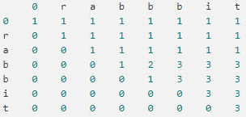

== distinct-subsequences
=== 题目描述
----
Given a string S and a string T, count the number of distinct subsequences of T in S.

A subsequence of a string is a new string which is formed from the original string by deleting
some (can be none) of the characters without disturbing the relative positions of the remaining
characters. (ie,"ACE"is a subsequence of"ABCDE"while"AEC"is not).

Here is an example:
S ="rabbbit", T ="rabbit"

Return3.

----

=== 分析
首先理解一下题意，也就是说有两个字符串 S,T 求S和T 的 "不同子序列",不同子序列，及从原序列总提出部分字符，只要保持顺序不乱就可以算成
不同子序列，如果S，T共同的子序列，就需要考虑 S[i]==T[j] 和 S[i]!=T[j]的情况。
我们假设dp[i][j] 标示 长度为i的字串在长度为j的母串中出现的次数
则 当 S[i-1]==T[j-1] 时 dp[i][j] = dp[i-1][j-1]+dp[i-1][j]
   当 S[i-1]!=T[j-1] 时 dp[i][j] = dp[i-1][j];

这是一个动态规划问题。
----

首先我们先要初始化矩阵，当子串长度为0时，所有次数都是1，当母串长度为0时，所有次数都是0.当母串子串都是0长度时，次数是1（因为都是空，相等）。接着，如果子串的最后一个字母和母串的最后一个字母不同，说明新加的母串字母没有产生新的可能性，可以沿用该子串在较短母串的出现次数，所以dp(i)(j) = dp(i)(j-1)。如果子串的最后一个字母和母串的最后一个字母相同，说明新加的母串字母带来了新的可能性，我们不仅算上dp(i)(j-1)，也要算上新的可能性。那么如何计算新的可能性呢，其实就是在既没有最后这个母串字母也没有最后这个子串字母时，子串出现的次数，我们相当于为所有这些可能性都添加一个新的可能。所以，这时dp(i)(j) = dp(i)(j-1) + dp(i-1)(j-1)。下图是以rabbbit和rabbit为例的矩阵示意图。计算元素值时，当末尾字母一样，实际上是左方数字加左上方数字，当不一样时，就是左方的数字
----

=== 考察点
动态规划

=== 代码实现
----
class Solution {
public:
    int numDistinct(string S, string T) {
        int row = S.size();
        int col = T.size();
        vector < vector <int> > dp;
        vector <int > tmp(col+1,0);
        //标示任何一个字符串变为 空 只有一种方法，其余初始化为0
        tmp[0] =1;
        for(int i=0;i<=row;i++){
            dp.push_back(tmp);
        }
        for(int i=1;i<=row;i++){
            for(int j=1;j<=col;j++){
                if(S[i-1] == T[j-1]){
                    dp[i][j] = dp[i-1][j-1] + dp[i-1][j];
                }else{
                    dp[i][j] = dp[i-1][j];
                }
            }
        }
        return dp[row][col];
    }
};
----
