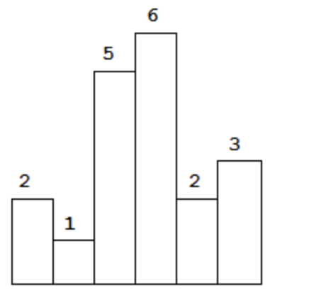
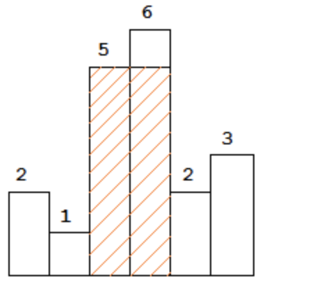

== largest-rectangle-in-histogram
=== 题目描述

----
Given n non-negative integers representing the histogram's bar height where the width of each bar is 1, find the area of largest rectangle in the histogram.
----

----
Above is a histogram where width of each bar is 1, given height =[2,1,5,6,2,3].
----

----
The largest rectangle is shown in the shaded area, which has area =10unit.

For example,
Given height =[2,1,5,6,2,3],
return10.
----

=== 分析
给定n个非负整数表示直方图的条形高度，其中每个条形的宽度为1，找到直方图中最大矩形的区域。
又是一个最优问题，好像不太符合动态规划的特征(解之间不相互依赖)，分制也不太符合(不能通过求小解组合得到大的解)，除了这两种常用求最优解方法外，还有一种贪心算法，也可以求最优解。
我们具体看一下我们这个贪心算法如果应用，也应该有一个贪婪规则，其实就是取最大值，收敛条件呢？如果我们将数据不停的入队，直到栈顶元素大于当前元素（height[s.top()] > height[i]） 我们就可以开始计算了，只需要让 当前 i-s.top() 就可以作为宽度，高度为当前栈顶所在位置元素，为了防止数据升序排列，我们可以在height末尾添加一个元素 0 【height.push_back(0)】。

=== 考察点
栈，贪心算法

=== 代码实现

----
class Solution {
public:
    int largestRectangleArea(vector<int> &height) {
        //故意多给一个0在最后
        height.push_back(0);
        stack <int> s;
        int temp = 0;
        int result = 0;
        //栈里面存的是每个元素之前的那个元素是左边离它最近的比它小的
        for(int i=0;i<height.size();i++){
            while(!s.empty() && height[s.top()] >= height[i]) {
                int h = height[s.top()];
                s.pop();
                int l = s.empty() ? -1 : s.top();
                int w = i - l - 1;
                result= max(result, w * h);
            }
            s.push(i);
        }
        /*单冲循环实现 注意 i++ 的位置
        for(int i=0;i<height.size();){
            if(s.empty() || height[i]>=height[s.top()] ){
                s.push(i);
                i++;
            }else{
                temp = s.top();
                s.pop();
                result = max(result,(s.empty()?i:i-s.top()-1)*height[temp]);
            }

        }*/
        return result;
    }
};
----
