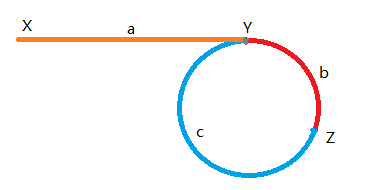

== linked-list-cycle-ii
=== 题目描述
----
Given a linked list, return the node where the cycle begins. If there is no cycle, returnnull.

Follow up:
Can you solve it without using extra space?
----
=== 分析
    从一个链表中找到环的开始（入口）节点，如果没有，则返回 null，是否能不使用额外的空间解决这个问题？
    首先考虑，应该如何做
    1. 判断是否为环比较好做，快慢指针，直到跑到有重合的节点即可表明是环存在，并记录节点Z，否则跑到为null 结束。
    2. 假设基于1，我们现在如何能够找到入口点。将两个指针分别放在入口位置X，与重合位置Z，同时向前走，相遇点Y既为所求。
----
证明如下：
如下图所示，X,Y,Z分别为链表起始位置，环开始位置和两指针相遇位置，则根据快指针速度为慢指针速度的两倍，可以得出：
2*(a + b) = a + b + n * (b + c)；即
a=(n - 1) * b + n * c = (n - 1)(b + c) +c;
注意到b+c恰好为环的长度，故可以推出，如将此时两指针分别放在起始位置和相遇位置，并以相同速度前进，当一个指针走完距离a时，另一个指针恰好走出 绕环n-1圈加上c的距离。
故两指针会在环开始位置相遇。
----

=== 考察点
链表，环

=== 代码实现

----
/**
 * Definition for singly-linked list.
 * struct ListNode {
 *     int val;
 *     ListNode *next;
 *     ListNode(int x) : val(x), next(NULL) {}
 * };
 */
class Solution {
public:
    ListNode *detectCycle(ListNode *head) {
        ListNode * fast = head;
        ListNode * slow = head;
        ListNode * tmp = head;
        if(head==NULL) return head;
        //快慢指针 找到重合点
        while(fast != NULL && fast->next !=NULL){
            fast = fast->next->next;
            slow = slow->next;
            if(fast == slow){
                break;
            }
        }
        //判断是否有环存在
        if(fast == NULL || fast->next ==NULL){
            return NULL;
        }
        //tmp 与 slow 同时走 重合点即入口点
        while(tmp != slow){
            tmp = tmp->next;
            slow = slow->next;
        }
        return tmp;
    }
};
----
