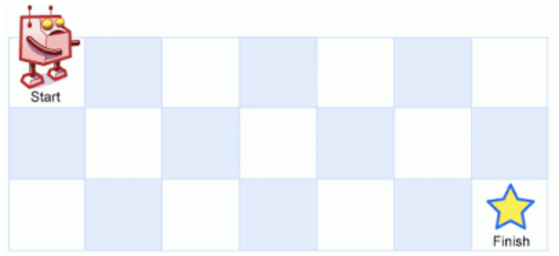

=== 题目描述
----
A robot is located at the top-left corner of a m x n grid (marked 'Start' in the diagram below).

The robot can only move either down or right at any point in time. The robot is trying to reach the bottom-right corner of the grid (marked 'Finish' in the diagram below).

How many possible unique paths are there?

Above is a 3 x 7 grid. How many possible unique paths are there?

Note: m and n will be at most 100.

----

=== 分析
很典型的动态规划题目，我们只需要，取每一步的（下，右）情况不停的累加即可。最上测与最左侧都应该初始化为1， 也就是说：
----
dp[0][j] = 1
dp[i][0] = 1
dp[i][j] = dp[i-1][j]+dp[i][j-1];
----

=== 考察点
动态规划

=== 代码

----
class Solution {
public:
    int uniquePaths(int m, int n) {
        vector<int> line(n,1);
        vector <vector <int> > dp(m,line);
        for(int i=1;i<m;i++){
          for(int j=1;j<n;j++){
            dp[i][j] = dp[i-1][j]+dp[i][j-1];
          }
        }
        return dp[m-1][n-1];
    }
};
----
