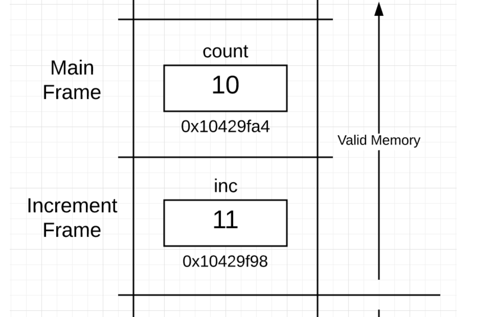
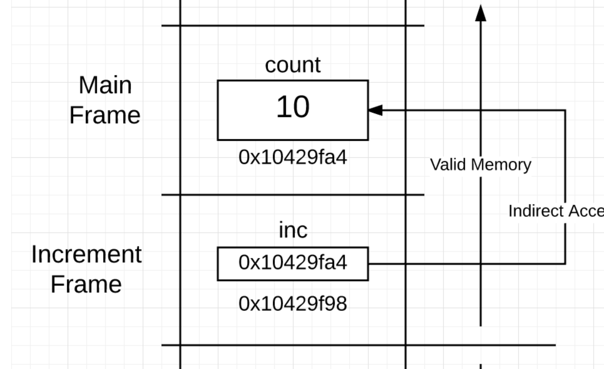
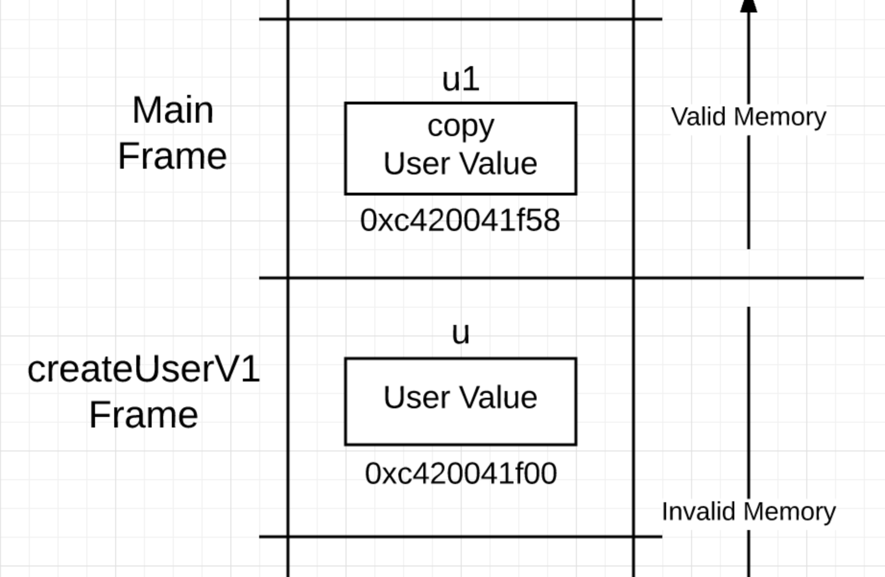
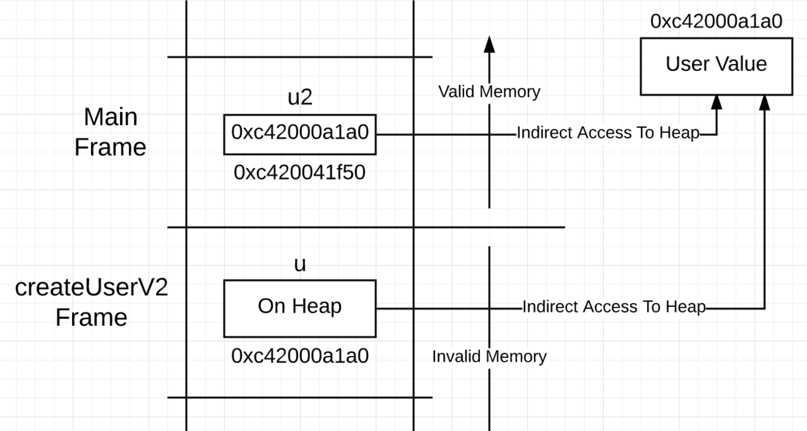

== golang 内存逃逸
原文共四篇
地址：
https://www.ardanlabs.com/blog/2017/05/language-mechanics-on-stacks-and-pointers.html[language-mechanics-on-stacks-and-pointers]
----
   文中从golang运行中栈内存的分布讲起，从函数单纯的传值，到传递指针，返回值为值还是地址/指针 对此时空间分配到堆还是栈进行
了分析文中配备了不同情况下堆栈分配的示意图。golang 在进行函数调用的时候传递参数，其实无论是指针还是值其实都是以传值的形式进行，
不同点在于指针传递的是指针的地址，此种操作就会导致栈中数据共享，而作为返回值，如果是一个地址或者指针，则会使内存分配到堆上，栈
中的地址都是指向堆中以实现共享，这个时候其实就发生了内存逃逸。
   而我的思考是，为什么传递参数的时候仅仅是 栈/上下文 中的内存共享，而返回参数的话如果是 地址/指针 就会使得内存分配到堆上。为什么
会产生这样的结果其实也不难理解，函数调用时，调用方是知道把参数传入了被调用方的，调用完成后被调用方接受到的参数以及分配的内存就会
释放。但是作为被调用方，并不知道会有哪些函数来调用更不知道返回结果会被用在什么场景下，此时也就类似于一个全局变量只是变量地址只能
通过调用此函数得到，所以就不能再返回结果之后就释放，因此也就产生了内存逃逸，将内存分配到了堆上。
----
传输值

----
01 package main
02
03 func main() {
04
05    // Declare variable of type int with a value of 10.
06    count := 10
07
08    // Display the "value of" and "address of" count.
09    println("count:\tValue Of[", count, "]\tAddr Of[", &count, "]")
10
11    // Pass the "value of" the count.
12    increment(count)
13
14    println("count:\tValue Of[", count, "]\tAddr Of[", &count, "]")
15 }
16
17 //go:noinline
18 func increment(inc int) {
19
20    // Increment the "value of" inc.
21    inc++
22    println("inc:\tValue Of[", inc, "]\tAddr Of[", &inc, "]")
23 }
----

内存分布

传输指针

----
01 package main
02
03 func main() {
04
05    // Declare variable of type int with a value of 10.
06    count := 10
07
08    // Display the "value of" and "address of" count.
09    println("count:\tValue Of[", count, "]\t\tAddr Of[", &count, "]")
10
11    // Pass the "address of" count.
12    increment(&count)
13
14    println("count:\tValue Of[", count, "]\t\tAddr Of[", &count, "]")
15 }
16
17 //go:noinline
18 func increment(inc *int) {
19
20    // Increment the "value of" count that the "pointer points to". (dereferencing)
21    *inc++
22    println("inc:\tValue Of[", inc, "]\tAddr Of[", &inc, "]\tValue Points To[", *inc, "]")
23 }
----

内存分配

返回指针

----
01 package main
02
03 type user struct {
04     name  string
05     email string
06 }
07
08 func main() {
09     u1 := createUserV1()
10     u2 := createUserV2()
11
12     println("u1", &u1, "u2", &u2)
13 }
14
15 //go:noinline
16 func createUserV1() user {
17     u := user{
18         name:  "Bill",
19         email: "bill@ardanlabs.com",
20     }
21
22     println("V1", &u)
23     return u
24 }
25
26 //go:noinline
27 func createUserV2() *user {
28     u := user{
29         name:  "Bill",
30         email: "bill@ardanlabs.com",
31     }
32
33     println("V2", &u)
34     return &u
35 }
----

内存分布

