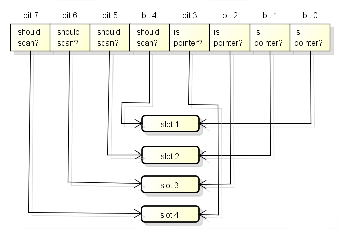

== golang 内存相关
1. 内存管理
2. 内存分配
3. 内存回收

=== TCMalloc
TCMalloc是google 开发的内存分配器。golang中就是用类似的算法进行内存分配。

我们其实大概可以看出  threadCache->CentralCache->PageHead 三层直接的关系

PageHead 将系统内存划分为不同的span，实现了 page -> span 的映射
CentralCache 将大小相同的span 穿成列表，实现了 span 按照大小归类
ThreadCache  其实是按照进程维度获取的一部分span 列表，目的是实现无锁分配，使得内存分配速度得以提升。

从这个维度看完之后其实我们就会明白 span 其实是一个关键概念，也是对象最后的存储“载体”，我们围绕span 的两个问题，其实就是内存相关的核心问题
1. span 内的对象如何存储
2. span 如何回收和分配

首先在golang 中 span 存储对象会有三种情况 这就是真正的对象存储
----
1. 用于保存大对象  （每个span 只有一个元素）
2. 用于保存极小对象且不包含指针 （span 会用一个元素保存多个对象）
3. span 包含多个大小相同的元素，一个元素会保存一个对象  （正常情况）
----
我们来关注一下 span 的分配和回收过程
首先从内存结构上，golang 对内存的区域划分和定义角度来看，任何进程在启动的时候都会自己的地址空间，go也不例外go 在启动的时候会分配一块虚拟连续
内存地址

image::../img/WX20200514-140430.png[]

 arena  就是我们常说的 heap，go 从heap分配的内崔都在这个区域中
 bitmap 用于标示arena区域中那些地址保存了对象，并且对象中那些地址包含了指针
 (一个byte，可以标示arena区域中4个指针大小的内存,也就是2bit 可以标示一个指针大小的内存【 8byte/4 = 2byte】)
 512G/8Byte ==> 有多少个指针区域 / 4 => 需要 多少内存的才能标示的完

 512G/8byte/4 = 16G
bitmap 区域中 1 byte 的结构 与 四个指针大小内存的结构关系如下
两个bit 分别表示  是否应该继续扫描 和 是否包含指针

bitmap中的byte和arena 的对应关系从末尾开始，也就是随着内存分配会向两边扩展:

spans 区域用于标示arena 区域中的某一页（page）属于哪个span
span区域中一个指针（8byte）对应了arena 区域中的一页 （go 一页 8k）
所以spans 的大小是 512G/8kB*8byte = 512MB

golang 中 m 一般理解为 系统进程。 g 就是我们所说的协程，p就是上下文（一般与cpu个数保持一致）
而我们的span 最后是会按照大小穿成一串，每个p分配134个不同大小的span，这样在执行过程中就可以优先从
p的mcache获取
p中缓存的span是区分 scan 和noscan 的
其中scan和noscan的区别在于,
如果对象包含了指针, 分配对象时会使用scan的span,
如果对象不包含指针, 分配对象时会使用noscan的span.
把span分为scan和noscan的意义在于,
GC扫描对象的时候对于noscan的span可以不去查看bitmap区域来标记子对象, 这样可以大幅提升标记的效率.

我们来整体合并一下 这几块

golang 的整个内存布局与概念关系我们大概有所了解了，我们来梳理一下运行过程中的使用顺序，或者分配顺序
----
首先从P的缓存(mcache)获取, 如果有缓存的span并且未满则使用, 这个步骤不需要锁
然后从全局缓存(mcentral)获取，全局缓存中有可用的span的列表, 如果获取成功则设置到P, 这个步骤需要锁
最后从mheap获取,mheap中也有span的自由列表, 如果都获取失败则从arena区域分配, 获取后设置到全局缓存, 这个步骤需要锁
----
image::../img/881857-20171122165741149-1015705312.png[]

以上就是整个go的分配过程和请求过程，我们接下来关注gc 过程
go 整个gc 高效在于 stop the world 的过程非常短，并且在gc 过程中还会调用一部分G去协助执行。
go 的回收方法主要采用 标记-清扫算法 ，目前采用三色法标记。
三色标记回收
----
1. 所有对象都标记为白色
2. 扫描白色对象，所有可达的对象标记为灰色
3. 从灰色对象中找到其引用对象标记为灰色，把灰色对象本身标记为黑色
----
最后剩下的白色对象就是不可达无引用的对象，就是可以回收对象。
我们来看一下golang的整个gc 过程

在此过程中我们会发现 stw 只有两段很短的时间(其余都是和业务并发的)，但是在整个标记清扫的过程中写屏障是一直开启的，我们有必要了解一下什么是写屏障。
我们考虑一个过程，在三色标记的时候我们并没有stw 也就意味着回收进程与业务进程同时在进行。如果这个时候，我们扫描了一个A 同时标记为了白色 A->白  ，但是业务代码对A进行了修改，是不是最后清扫的时候就会把还在使用的数据给清理掉，同样也会有一些内存已经不再使用但是无法回收。
也就是说我们需要在不进行stw 的情况下能够感知 这种扫描过的内存的改变，所以就有了写屏障。

image::../img/WX20200515-181820@2x.png[]

当以下两个条件同时满足时会破坏垃圾回收器的正确性
----
条件 1: 赋值器修改对象图，导致某一黑色对象引用白色对象；
条件 2: 从灰色对象出发，到达白色对象的、未经访问过的路径被赋值器破坏。
----
只要能够避免其中任何一个条件，则不会出现对象丢失的情况，因为：

如果条件 1 被避免，则所有白色对象均被灰色对象引用，没有白色对象会被遗漏；
如果条件 2 被避免，即便白色对象的指针被写入到黑色对象中，但从灰色对象出发，总存在一条没有访问过的路径，从而找到到达白色对象的路径，白色对象最终不会被遗漏。

有两种非常经典的写屏障：Dijkstra 插入屏障和 Yuasa 删除屏障。
灰色赋值器的 Dijkstra 插入屏障的基本思想是避免满足条件 1：
----
// 灰色赋值器 Dijkstra 插入屏障
func DijkstraWritePointer(slot *unsafe.Pointer, ptr unsafe.Pointer) {
    shade(ptr)
    *slot = ptr
}
----

为了防止黑色对象指向白色对象，我们应该假设*slot可能会变为黑色，为了确保 ptr 不会被赋值到 *slot前变为白色，shade(ptr) 会先将指针ptr 标记为灰色(只要有赋值本次不回收，留到下次扫描)，进而避免了条件1

dijkstra插入屏障的好处在于可以理科开始并发标记，但是有两个缺点
1、在一次回收过程中可能会彩六部分对象灭有回收成功，只有在下一个回收过程中才会被回收。
2、在标记阶段，每次指针赋值操作时，都需要引入写屏障，或有大量性能开销；go团队最终实现是没有为所有栈上的指针写操作启用写屏障，而是当发生栈上的写操作时，将栈标记为灰色，但是由此产生了灰色赋值器，将会需要标记终止阶段STW时候对这些栈进行重新扫描。

另一种比较经典的写屏障是黑色赋值器的 Yuasa 删除屏障。其基本思想是避免满足条件 2：
----
// 黑色赋值器 Yuasa 屏障
func YuasaWritePointer(slot *unsafe.Pointer, ptr unsafe.Pointer) {
    shade(*slot)
    *slot = ptr
}
----

（也就是说我只要让未扫描过的对象都有机会重新进行扫描即可保证不会遗漏。）
为了防止丢失从灰色对象到白色对象的路径，应该假设 *slot可能会变为黑色，为了确保ptr 不会在被赋值到*slot前变为白色，shade(*slot) 会先将*slot标记为灰色，进而该写操作总会创建一条灰色到灰色或者灰色到白色对象的路径从而避免条件2

yuasa删除屏障的优势则在于不需要标记结束阶段从新扫描，结束的时候能够准确回收所有需要回收的白色对象。缺项是yuasa删除屏障会拦截写操作，进而导致“灰色”，产生冗余的扫描：

Go 在 1.8 的时候为了简化 GC 的流程，同时减少标记终止阶段的重扫成本，将 Dijkstra 插入屏障和 Yuasa 删除屏障进行混合，形成混合写屏障。该屏障提出时的基本思想是：对正在被覆盖的对象进行着色，且如果当前栈未扫描完成，则同样对指针进行着色。

但在最终实现时原提案[4]中对 ptr 的着色还额外包含对执行栈的着色检查，但由于时间有限，并未完整实现过，所以混合写屏障在目前的实现伪代码是：
----
// 混合写屏障
func HybridWritePointerSimple(slot *unsafe.Pointer, ptr unsafe.Pointer) {
    shade(*slot)
    shade(ptr)
    *slot = ptr
}
----
在这个实现中，如果无条件对引用双方进行着色，自然结合了 Dijkstra 和 Yuasa 写屏障的优势，但缺点也非常明显，因为着色成本是双倍的，而且编译器需要插入的代码也成倍增加，随之带来的结果就是编译后的二进制文件大小也进一步增加。为了针对写屏障的性能进行优化，Go 1.10 前后，Go 团队随后实现了批量写屏障机制。其基本想法是将需要着色的指针统一写入一个缓存，*每当缓存满时统一对缓存中的所有 ptr 指针进行着色。*

参考：
https://www.cnblogs.com/wangbin/p/10647923.html
https://www.bookstack.cn/read/qcrao-Go-Questions/spilt.9.GC-GC.md
