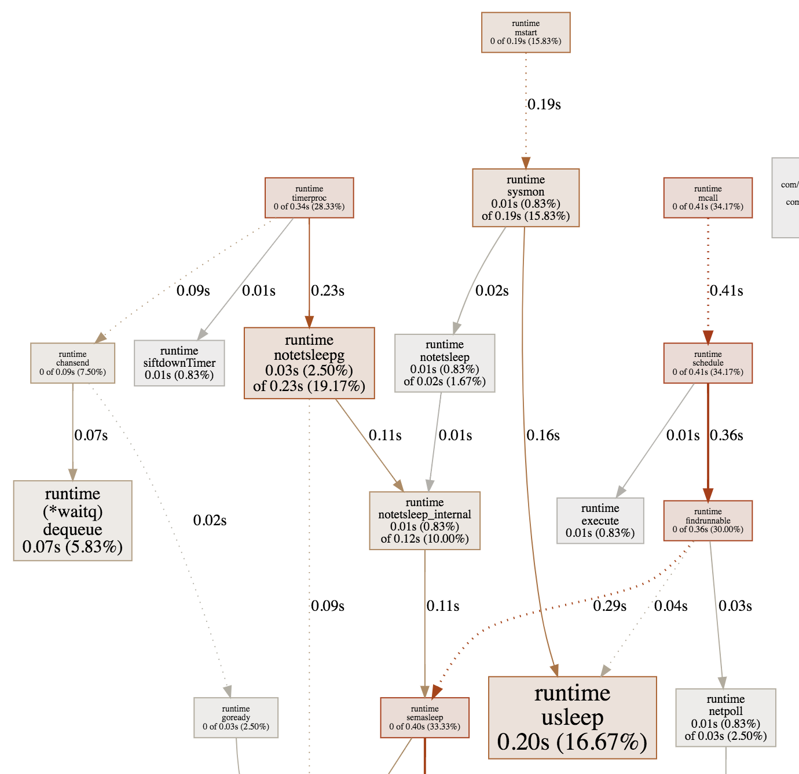

=== 2019年工作中work-pool带出来的一个坑

工作中总有一些细节、零碎的地方，短时间不记录还记得，长时间不记录就慢慢的遗忘了。在此记录一下大致背景，排查过程等东西。

发现坑：
年后一批服务统一迁移弹性云，突然发现某一个重要服务 ServiceA 迁移之后过个周六日时不时的报一次cpu占用率过高，这在之前是没有出现过的，
尴尬的是这个重要的服务没有一行代码使我写的，我只是迁移一下（心里那个怕啊）。登录到监控平台查看，发现cpu 空闲率 一直在 60%上下浮动，时不时的
突然下跌一下，看看报警时间点，对上了！理所应当的认为机器性能太差嘛？加机器不行换更高配置的，好短暂解决了。然而，过了一天有报警了。此时开始感觉
有坑啊？妈蛋，服务虽然不是我写的，但是我还是大致知道它是干嘛的服务，不可能一天都在高峰期啊，平峰的时候为啥cpu还居高不下啊？有量的时候反而不怎么
报警报警的时候大多都在空闲阶段。代码一定有问题，第一反应，有进程在不停的占用cpu，定时任务？

排查坑：
代码下载到本地，启动，发现本地cpu超过的100%，好吧！基本判断还不指一个协程在强奸cpu啊！上神器，pprof 查看一下服务在搞什么。

我的乖乖，不得了了，竟然都引起 stopm了，说到这里大概说一下 go 语言的整个调度模型 GMP。
----
go抽象出来一个G就是我们所说的协程，m可以理解为操作系统提供的进程，p基本上是cpu 有多少个核心就会有多少个，每个p要绑定一个m，然后才可以执行G
协程多了就优先放到全局队列，每个 p 后面都有一个局部队列，如果碰到一个G需要执行很长时间，则将会把m与g进行绑定，单独执行，当前p从新绑定一个m（m
没有了会自动在创建一个，优先从空闲的m里面取），然后接着执行。某个 p 的队列执行完了，会尝试从其他p的队列去偷过来一半（或从全局队列去取），但是当
m在全局队里也取不到，从其他p的队列偷也偷不到的时候，注意 M其实就没有事情可以干了，那就休眠吧！放入M的休眠队列，等待有任务的时候再取出来。这也
就说明了go的协程为什么那么快，因为他在用M去抢占cpu的资源，G的上下文切换不经过任何寄存器全部都在G自己的结构中，放到任何一个M上都能继续执行，减少
了上下文切换。所以G的停止和调度都是很轻量级的，但是M一旦休眠或者从新调度，成本就相对大了。
----
所有，引起了go的M休眠，这个事情是很严重的！好，看看到底是谁干的? 那就看pprof 导出图中的另一部分吧！虽然只在图中站了一小块，但是必定是从这里
开始的业务，追一下业务代码。

image::../img/golang-work-pool-careful-fce16.png[]

代码中函数调用了一个workpool（都希望优雅一点）大致如下：

----
package model

import "time"

type WorkerPool struct {
	Size    int
	F       func()
	Workers []*Worker
}

type Worker struct {
	Stop chan struct{}
	F    func()
}

func (wp *WorkerPool) Start() {
	for i := 0; i < wp.Size; i++ {
		w := &Worker{Stop: make(chan struct{}), F: wp.F}
		w.start()
		wp.Workers = append(wp.Workers, w)
	}
}

func (wp *WorkerPool) Stop() {
	for _, w := range wp.Workers {
		w.Stop <- struct{}{}
	}
}

func (w *Worker) start() {
	go func() {
		for {
			select {
			case <-w.Stop:
				return
			default :
				w.F()
			}
		}
	}()
}

----

调用也很简单：
----
var (
	Wp *model.WorkerPool
)

func StartSendCouponSchedule() {
	model.InitTaskQueue()
	Wp = &model.WorkerPool{Size: 10, F: model.ConsumerTaskQueue}   //启动了10 个协程，不停的在 default 里面执行  ConsumerTaskQueue
	Wp.Start()
}

func StopSendCouponSchedule() {
	Wp.Stop()
}

----

貌似也没有太大问题啊，执行就执行呗！会大量占用cpu 但是也不会引起M的stop吧！考虑一个这样的场景，在要执行的函数里面不大不小的来了一个sleep，会
怎么样？

----
//EMPTY_TASK_TIME_SLEEP =10
func ConsumerTaskQueue() {
	v, err := TaskQueue.Pop()
	if v == nil {
		 log.Infof("_undef||get_task=%s", v)
		time.Sleep(EMPTY_TASK_TIME_SLEEP * time.Microsecond)
		return
	}
  ...
}
----
好，问题症结找到了，先去消息队列拉取数据，拉取不到，sleep 10 毫秒。找到是找到了，咱也不敢随便动啊！动得保证不出乱子啊！
第一步：workPool中的 default 干掉吧！ 既然是一个后面的定时任务，就委屈一下，10个协程，每个间隔两毫秒总行吧?（两毫秒，差距就很大）
第二步：消息队列里面的sleep 停掉吧！都是空了，你等个毛线啊！里面返回就好

----
//workPool 改动点
func (w *Worker) start() {
	go func() {
		for {
			select {
			case <-w.Stop:
				return
			case <-time.After(time.Millisecond * 2):
				w.F()
			}
		}
	}()
}
//ConsumerTaskQueue 改动点
//EMPTY_TASK_TIME_SLEEP =10
func ConsumerTaskQueue() {
	v, err := TaskQueue.Pop()
	if v == nil {
		log.Infof("_undef||get_task=%s", v)
		return
	}
  ...
}
----
看一结果，workPool 改动完之后，先不改动sleep，很明显 stepm 操作还有，但是sleep 对应的usleep 调用比例开始增加，猜想基本正确，此时本地跑cpu
占用率跌到15%左右，但是还是难以接受

继续优化，去掉sleep ,本地cpu 占用率 降低到 10%左右，想再降低？ 调整workerPool 的间隔时间 为 10 毫秒，基本可以降低到 3%左右。stop 几乎消失

我们看到虽然还有usleep的调用，但是来源已经不再是业务系统中的sleep了，暂时达到目的，测试->上线，在看cpu空闲率，空闲阶段基本维持在95%上下，看来
线上机器果然比自己的电脑性能高啊！

顺便在看一下另一个后端异步处理代码，同样导致了cpu空闲率居高不下，本地运行一个核跑满,为了清晰不相干的代码就省略了。
----
//同步任务状态
func (sc *DefaultScheduler) SyncTaskStatus(config *Config) {
	go func() {
		for {
			select {
			case result, ok := <-sc.TaskResult:
				log.Infof("_timed_scheduler_synctask_taskresult_in||taskResult=%v||ok=%v", result, ok)
				if ok {
					.....
				}
      //干掉这个分支，它真的没用，cpu 会降低到 正常，整个程序也就大概是1%左右
			default:
			}
		}
	}()
}

----

很明显，如果 sc.TaskResult 里面没有数据，这段代码等价于下面，就相当于一个死循环。G自然就会在一个m里面死命的执行。
----
go func(){
  for{}
}
----
在pprof导出的图中的呈现为

纯粹的消耗cpu 连stopm 都不会有，如何优化，干掉 //default:  即可 记录一下仅仅作为工作中的积累。pprof 详细使用不进行介绍。
