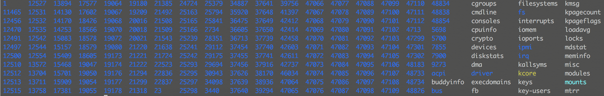
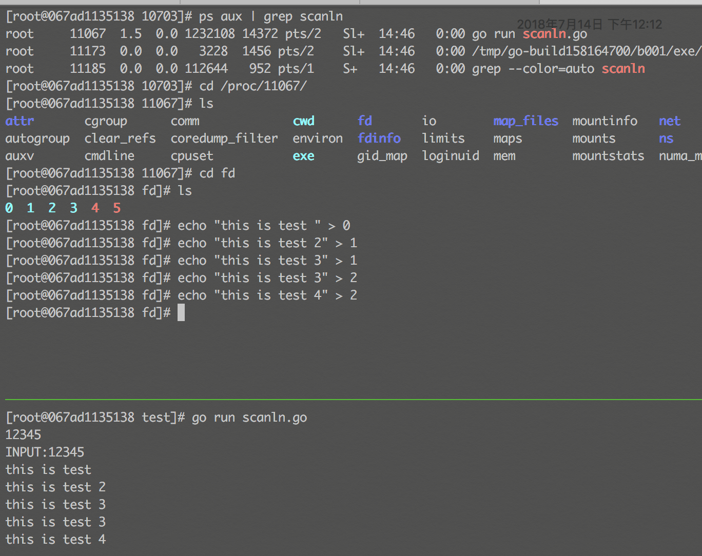

== linux下proc文件夹
这周周会上一同事抛出一个问题，问：“我们的监控系统是如何对一些进程、cpu、io等进行监控，也就是监控从何处采集这些数据.” 其实linux下有一个/proc 目录,存储的是当前内核运行状态的一系列特殊文件，里面囊括了大量和我们操作系统运行期间有关的数据，让我来实际看一下。此文仅仅作为了解，具体详情请参考专业文档

----
[test@70ae0c90ae57 proc]$ ps aux | grep scm
test   24724  5.2  0.0 2680596 42384 ?       Sl   Jul13  44:51 output/bin/scm
test   25351  0.0  0.0 112664   968 pts/2    S+   11:39   0:00 grep --color=auto scm
[test@70ae0c90ae57 proc]$ cd 24724
[test@70ae0c90ae57 24724]$ ll
total 0
dr-xr-xr-x  2 test test 0 Jul 13 21:29 attr
-rw-r--r--  1 test test 0 Jul 13 21:30 autogroup
-r--------  1 test test 0 Jul 13 21:30 auxv
-r--r--r--  1 test test 0 Jul 13 21:30 cgroup
--w-------  1 test test 0 Jul 13 21:30 clear_refs
-r--r--r--  1 test test 0 Jul 13 21:29 cmdline
-rw-r--r--  1 test test 0 Jul 13 21:30 comm
-rw-r--r--  1 test test 0 Jul 13 21:30 coredump_filter
-r--r--r--  1 test test 0 Jul 13 21:30 cpuset
lrwxrwxrwx  1 test test 0 Jul 13 21:30 cwd -> /home/test/scm
-r--------  1 test test 0 Jul 13 21:30 environ
lrwxrwxrwx  1 test test 0 Jul 13 21:29 exe -> /home/test/scm/output/bin/scm
dr-x------  2 test test 0 Jul 13 21:29 fd
dr-x------  2 test test 0 Jul 13 21:30 fdinfo
-rw-r--r--  1 test test 0 Jul 13 21:30 gid_map
-r--------  1 test test 0 Jul 13 21:30 io
-r--r--r--  1 test test 0 Jul 13 21:30 limits
-rw-r--r--  1 test test 0 Jul 13 21:30 loginuid
dr-x------  2 test test 0 Jul 13 21:30 map_files
-r--r--r--  1 test test 0 Jul 13 21:30 maps
-rw-------  1 test test 0 Jul 13 21:30 mem
-r--r--r--  1 test test 0 Jul 13 21:30 mountinfo
-r--r--r--  1 test test 0 Jul 13 21:30 mounts
-r--------  1 test test 0 Jul 13 21:30 mountstats
dr-xr-xr-x  4 test test 0 Jul 13 21:30 net
dr-x--x--x  2 test test 0 Jul 13 21:30 ns
-r--r--r--  1 test test 0 Jul 13 21:30 numa_maps
-rw-r--r--  1 test test 0 Jul 13 21:30 oom_adj
-r--r--r--  1 test test 0 Jul 13 21:30 oom_score
-rw-r--r--  1 test test 0 Jul 13 21:30 oom_score_adj
-r--r--r--  1 test test 0 Jul 13 21:30 pagemap
-r--r--r--  1 test test 0 Jul 13 21:30 personality
-rw-r--r--  1 test test 0 Jul 13 21:30 projid_map
lrwxrwxrwx  1 test test 0 Jul 13 21:30 root -> /
-rw-r--r--  1 test test 0 Jul 13 21:30 sched
-r--r--r--  1 test test 0 Jul 13 21:30 schedstat
-r--r--r--  1 test test 0 Jul 13 21:30 sessionid
-rw-r--r--  1 test test 0 Jul 13 21:30 setgroups
-r--r--r--  1 test test 0 Jul 13 21:30 smaps
-r--r--r--  1 test test 0 Jul 13 21:30 stack
-r--r--r--  1 test test 0 Jul 13 21:29 stat
-r--r--r--  1 test test 0 Jul 13 21:30 statm
-r--r--r--  1 test test 0 Jul 13 21:30 status
-r--r--r--  1 test test 0 Jul 13 21:30 syscall
dr-xr-xr-x 69 test test 0 Jul 13 21:30 task
-r--r--r--  1 test test 0 Jul 13 21:30 timers
-rw-r--r--  1 test test 0 Jul 13 21:30 uid_map
-r--r--r--  1 test test 0 Jul 13 21:30 wchan
----
我们通过ps 找到进程，进入到 /proc/进程id/  目录下可以看到 很明显的有 fd，io，net，mem，oom_score 等文件,我们进到fd看一下，这里是所有进程所打开的句柄，最少0,1,2 对一个的标准输入、标准输出、标准错误输出，那么剩余的呢，我们会看到 有socket、log文件和epoll 创建的文件。
----
[test@70ae0c90ae57 fd]$ ls
0  1  10  11  12  13  14  15  16  17  18  19  2  20  21  22  23  25  26  27  28  29  3  30  31  32  33  34  35  36  37  38  39  4  5  6  7  8  9
[test@70ae0c90ae57 fd]$ ll
total 0
l-wx------ 1 test test 64 Jul 13 21:29 0 -> /dev/null
l-wx------ 1 test test 64 Jul 13 21:29 1 -> /home/test/scm/nohup.out
l-wx------ 1 test test 64 Jul 13 21:29 10 -> /home/test/scm/log/all.log
lrwx------ 1 test test 64 Jul 13 21:29 11 -> socket:[4162821155]
l-wx------ 1 test test 64 Jul 13 21:29 12 -> /home/test/scm/log/mq/mq.log
lrwx------ 1 test test 64 Jul 13 21:29 13 -> socket:[4089293888]
lrwx------ 1 test test 64 Jul 13 21:29 14 -> socket:[4162813136]
lrwx------ 1 test test 64 Jul 13 21:29 15 -> socket:[4162813137]
lrwx------ 1 test test 64 Jul 13 21:29 16 -> socket:[4162818190]
lrwx------ 1 test test 64 Jul 13 21:29 17 -> socket:[4163279370]
lrwx------ 1 test test 64 Jul 13 21:29 18 -> socket:[4163304659]
lrwx------ 1 test test 64 Jul 13 21:29 19 -> socket:[4159855236]
l-wx------ 1 test test 64 Jul 13 21:29 2 -> /home/test/scm/nohup.out
lrwx------ 1 test test 64 Jul 13 21:29 20 -> socket:[4163279371]
lrwx------ 1 test test 64 Jul 13 21:29 21 -> socket:[4161655524]
lrwx------ 1 test test 64 Jul 13 21:29 22 -> socket:[4163598233]
lrwx------ 1 test test 64 Jul 13 21:29 23 -> socket:[4162815289]
lrwx------ 1 test test 64 Jul 13 21:29 25 -> socket:[4161515028]
l-wx------ 1 test test 64 Jul 13 21:29 26 -> /home/test/scm/log/mq/WARNING.log
l-wx------ 1 test test 64 Jul 13 21:29 27 -> /home/test/scm/log/mq/INFO.log
l-wx------ 1 test test 64 Jul 13 21:29 28 -> /home/test/scm/log/mq/FATAL.log
l-wx------ 1 test test 64 Jul 13 21:29 29 -> /home/test/scm/log/mq/ERROR.log
lrwx------ 1 test test 64 Jul 13 21:29 3 -> socket:[4089293887]
lrwx------ 1 test test 64 Jul 13 21:29 30 -> socket:[4089283006]
lrwx------ 1 test test 64 Jul 13 21:29 31 -> socket:[4089283007]
lrwx------ 1 test test 64 Jul 13 21:29 32 -> socket:[4089296970]
lrwx------ 1 test test 64 Jul 13 21:30 33 -> socket:[4089294080]
l-wx------ 1 test test 64 Jul 13 21:30 34 -> /home/test/scm/log/error.log
lr-x------ 1 test test 64 Jul 13 21:30 35 -> /dev/urandom
lrwx------ 1 test test 64 Jul 13 21:30 36 -> socket:[4089757213]
l-wx------ 1 test test 64 Jul 13 21:32 37 -> /home/test/scm/log/mq/error.log
l-wx------ 1 test test 64 Jul 13 21:44 38 -> /home/test/scm/log/mq/DEBUG.log
lrwx------ 1 test test 64 Jul 13 21:43 39 -> socket:[4098822105]
lrwx------ 1 test test 64 Jul 13 21:29 4 -> anon_inode:[eventpoll]
lrwx------ 1 test test 64 Jul 14 10:28 40 -> socket:[4163825501]
lrwx------ 1 test test 64 Jul 13 21:29 5 -> socket:[4072696687]
lrwx------ 1 test test 64 Jul 13 21:29 6 -> socket:[4162881614]
lrwx------ 1 test test 64 Jul 13 21:29 7 -> socket:[4162784073]
lrwx------ 1 test test 64 Jul 13 21:29 8 -> socket:[4163265380]
lrwx------ 1 test test 64 Jul 13 21:29 9 -> socket:[4161584551]
----
再来看一下io 都有什么,毋庸置疑的是，这些都是进程在运行的时候记录下来的相关参数
----
[test@70ae0c90ae57 24724]$ cat io
rchar: 63174241
wchar: 95574863
syscr: 2860378
syscw: 3341419
read_bytes: 663552
write_bytes: 56569856
cancelled_write_bytes: 0
----
所以随查询了一下proc目录的相关信息，做一下笔记，留作复习

常见的proc 下的文件
----
1.cmdline — 启动当前进程的完整命令，但僵尸进程目录中的此文件不包含任何信息；
2.cwd — 指向当前进程运行目录的一个符号链接；
3.environ — 当前进程的环境变量列表，彼此间用空字符（NULL）隔开；变量用大写字母表示，其值用小写字母表示；
4.exe — 指向启动当前进程的可执行文件（完整路径）的符号链接，通过/proc/N/exe可以启动当前进程的一个拷贝；
5.fd — 这是个目录，包含当前进程打开的每一个文件的文件描述符（file descriptor），这些文件描述符是指向实际文件的一个符号链接；
6.limits — 当前进程所使用的每一个受限资源的软限制、硬限制和管理单元；此文件仅可由实际启动当前进程的UID用户读取；（2.6.24以后的内核版本支持此功能）；
7.maps — 当前进程关联到的每个可执行文件和库文件在内存中的映射区域及其访问权限所组成的列表；
8.mem — 当前进程所占用的内存空间，由open、read和lseek等系统调用使用，不能被用户读取；
9.root — 指向当前进程运行根目录的符号链接；在Unix和Linux系统上，通常采用chroot命令使每个进程运行于独立的根目录；
10.stat — 当前进程的状态信息，包含一系统格式化后的数据列，可读性差，通常由ps命令使用；
11.statm — 当前进程占用内存的状态信息，通常以“页面”（page）表示；
12.status — 与stat所提供信息类似，但可读性较好，每行表示一个属性信息；
13.task — 目录文件，包含由当前进程所运行的每一个线程的相关信息，每个线程的相关信息文件均保存在一个由线程号（tid）命名的目录中，这类似于其内容类似于每个进程目录中的内容；（内核2.6版本以后支持此功能）
----
最后我们来对fd 做一个测试，既然在fd里面可以找到 标准输入 标准输出 的文件描述符，我们是否可以利用它对程序进行输入输出呢？
我们简单的写一段代码，但是结果是程序直接进行了输出并没有触发任何逻辑
----
package main

import "fmt"

func main() {
	var str string
	for i := 0; i < 10; i++ {
		fmt.Scanln(&str)
		fmt.Printf("INPUT:%s\n", str)
	}
}

----

参考： https://www.cnblogs.com/DswCnblog/p/5780389.html[linux /proc目录详解]
