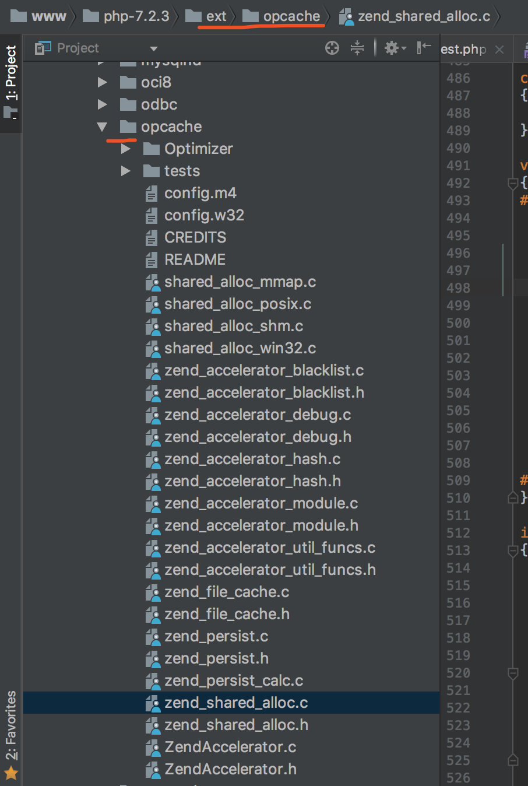

== php opache ==
. PHP底层基础
. PHP扩展
. 了解 opcode
. 了解 opcache

=== php底层基础 ===
php 是一门弱类型语言，也称解释型语言，底层由c语言实现。基于一门语言构造出另外一门语言本身就是一个语法规则，词法规则的实现，而php
底层源码会充斥着大量的一层二层三层指针，以及各种define 定义，php底层通过已经成型的lex来做词法分析，进行完词法、语法分析后会生成opcode，也就是php的中间代码，最终zend引擎执行的也是opcode。
我们来看一下php7的源码目录结构
----
bogon:php-7.2.3 didi$  ls -l | grep ^d
drwxr-xr-x@  22 didi  admin      748  2 28  2018 TSRM
drwxr-xr-x@ 146 didi  admin     4964  2 28  2018 Zend
drwxr-xr-x@   6 didi  admin      204  2 28  2018 appveyor
drwxr-xr-x@  14 didi  admin      476  2 28  2018 build
drwxr-xr-x@  78 didi  admin     2652  2 28  2018 ext
drwxr-xr-x@  56 didi  admin     1904  2 28  2018 main
drwxr-xr-x@   6 didi  admin      204  2 28  2018 pear
drwxr-xr-x@  10 didi  admin      340  2 28  2018 sapi
drwxr-xr-x@   8 didi  admin      272  2 28  2018 scripts
drwxr-xr-x@  11 didi  admin      374  2 28  2018 tests
drwxr-xr-x@   4 didi  admin      136  2 28  2018 travis
drwxr-xr-x@  59 didi  admin     2006  2 28  2018 win32
bogon:php-7.2.3 didi$
----
* ext 官方扩展目录，包含了绝大多数php的函数定义与实现，pdo，array，mysql 等都是以扩展方式实现。
* zend zend引擎，php脚本的词法语法解析，opcache 的执行以及扩展机制的加载等。
* main 这里是php最为核心的文件，主要实现php的基本设施，这里和zend 引擎不同，zend 主要实现语言最核心的的语言环境，语法词法解析、opcache执行，php扩展机制的加载，等等 而main 中实现的则更多为，php扩展中或者sapi 中甚至zend引擎中需要用到的基础函数。
sapi 包含了各种php对外服务的抽象层，如CGI，fastcgi，php—fpm，等均在此处。
  例如在sapi/fpm/fpm/fpm_main.c （很多地方都在用）中用到的 php_request_startup() 定义在 main/php_main.h 并在 main/main.c 中实现。将 zend 中的 zend_spprintf（）函数 重定义为 spprintf，并在各种扩展中使用,zend目录中的源码则还使用zend_spprintf.
----
#define spprintf zend_spprintf   // 文件位置 ：main/spprintf.h

//函数声明  Zend/zend.h
ZEND_API size_t zend_spprintf(char **message, size_t max_len, const char *format, ...)  ZEND_ATTRIBUTE_FORMAT(printf, 3, 4);

// 函数实现  Zend/zend.c

ZEND_API size_t zend_spprintf(char **message, size_t max_len, const char *format, ...) /* {{{ */
{
	va_list arg;
	size_t len;

	va_start(arg, format);
	len = zend_vspprintf(message, max_len, format, arg);
	va_end(arg);
	return len;
}
----
* TSRM php 分为线程安全与飞线程安全，很多底层代码，线程安全是需要带上 TSRM 标志的，
* pear "php7扩展与应该仓库”，包含PEAR 的核心文件。

了解了以上PHP底层源码的基本目录结构，其实我们可以大概总结一下，我们所用的php 其实是基于一段zend 引擎可以解析的脚本，可以认为是虚拟机，而php里面众多的函数或类以扩展库的方式存在也就是ext目录，而php通过sapi 对外提供服务，也就是不管通过 php  aa.php  执行一段php脚本，还是通过url 访问一个页面，最终到php层面，都是通过 sapi 层开始，只是命令行用的是cli，nginx 用的是 fpm，apache 用的是mod_php 将脚本信息发送给 zend ，然后zend 通过 调用词法语法分析，产生opcache 并执行，后将结果返回给最终的调用方（sapi）。其实sapi就是php与各个服务器抽象层直接所遵守的相同的约定。

php 架构图 ：

image::../img/WX20180911-130706@2x.png[]

这里可以看一下 sapi 的生命周期：
无论我们用 cli 在命令行下执行，还是 fpm 用在nginx下，对于每种情况下都需要 依次进行Module init、Request init、Request Shutdown、Module shutdown四个过程 ，Minit MshutDown 分别 标示在PHP启动时模块加载阶段以及模块关闭阶段，Rinit Rshutdown 是每次请求都会进行触发。

cli/cgi 单进程下的执行流程:

image::../img/02-01-01-cgi-lift-cycle.png[]

基于此，cli 模式下 每次执行php 都需要进行 MInit，RInit，rShutDown，MshutDown这四个阶段，但是在web 模式下 其实 Minit 与 MshutDown 是没有必要每次都启动的，只需要启动一次即可。所以基于此就有了php-fpm ，遵循fastcgi 模式，多进程模式进行管理php。
----
          MINIT
              RINIT
              RSHUTDOWN
          MshutDown

fpm             ...

          MINIT
            RINIT
            RSHUTDOWN
          MshutDown
          ...
----

也就是 fpm 维护了这么一个进程池，master 管理多个 worker ，每个worker 在都已经运行了MINIT 当一个web 请求发送过来后，通过fastcgi协议，将具体需要执行的代码发送给fpm，fpm 将其转发到 一个worker 中进行执行，并将执行结果返回。此处与nginx 的模式还不一样，最大的区别在于每一个phpfpm进程只能处理一个请求，请求结束，才能开始处理下一个。而nginx 采用的虽然也是master - worker 多进程 模式，但是不同点在于nginx采用的高级IO 通过 epoll 、poll、select等机制进行处理，不需要等某一次请求完全结束才执行下次请求，所以并发能力是没法比较的。

=== php 扩展 ===

了解完php 的相关的整体架构，我们开始看一下php扩展。php 扩展只是从php底层架构层面来说，对应应用层其实是无感知的，无论你用array去构建一个数组，还是调用pdo 去连接mysql 都是扩展实现，而与zend 和 sapi 无关，而在次过程中，php业务层是无需关注的。

php7.2.3 ext 目录扩展
----
localhost:ext didi$ ls
bcmath			exif			iconv			oci8			pdo_oci			reflection		sqlite3			xmlrpc
bz2			ext_skel		imap			odbc			pdo_odbc		session			standard		xmlwriter
calendar		ext_skel_win32.php	interbase		opcache			pdo_pgsql		shmop			sysvmsg			xsl
com_dotnet		fileinfo		intl			openssl			pdo_sqlite		simplexml		sysvsem			zend_test
ctype			filter			json			pcntl			pgsql			skeleton		sysvshm			zip
curl			ftp			ldap			pcre			phar			snmp			tidy			zlib
date			gd			libxml			pdo			posix			soap			tokenizer
dba			gettext			mbstring		pdo_dblib		pspell			sockets			wddx
dom			gmp			mysqli			pdo_firebird		readline		sodium			xml
enchant			hash			mysqlnd			pdo_mysql		recode			spl			xmlreader
----

首先咱们根据的理解，对应每一个扩展也应该有 MINIT ，RINIT，RShutDown，MShutDown 这四个过程，否则zend而是无法加载的。 +

. PHP_FUNCTION()            //注册一个PHP 函数
----
//等同于 PHP_FUNCTION
static ZEND_FUNCTION(opcache_is_script_cached)
{
	zend_string *script_name;
	if (!validate_api_restriction()) {
		RETURN_FALSE;
	}
	if (!ZCG(enabled) || !accel_startup_ok || !ZCSG(accelerator_enabled)) {
		RETURN_FALSE;
	}
	if (zend_parse_parameters(ZEND_NUM_ARGS(), "S", &script_name) == FAILURE) {
		return;
	}
	RETURN_BOOL(filename_is_in_cache(script_name));
}
----
. zend_function_entry       //定义模块对应对应的function 列表
----
static zend_function_entry accel_functions[] = {
	/* User functions */
	ZEND_FE(opcache_reset,					arginfo_opcache_none)
	ZEND_FE(opcache_invalidate,				arginfo_opcache_invalidate)
	ZEND_FE(opcache_compile_file,			arginfo_opcache_compile_file)
	ZEND_FE(opcache_is_script_cached,		arginfo_opcache_is_script_cached)
	/* Private functions */
	ZEND_FE(opcache_get_configuration,		arginfo_opcache_none)
	ZEND_FE(opcache_get_status,				arginfo_opcache_get_status)
	ZEND_FE_END
};
----

. zend_module_entry         //定义整个模块的信息
----
static zend_module_entry accel_module_entry = {
	STANDARD_MODULE_HEADER,
	ACCELERATOR_PRODUCT_NAME,
	accel_functions,
	ZEND_MINIT(zend_accelerator),
	ZEND_MSHUTDOWN(zend_accelerator),
	NULL,
	NULL,
	zend_accel_info,
	PHP_VERSION,
	NO_MODULE_GLOBALS,
	accel_post_deactivate,
	STANDARD_MODULE_PROPERTIES_EX
};
----
----
struct _zend_module_entry {
    unsigned short size;
    unsigned int zend_api;
    unsigned char zend_debug;
    unsigned char zts;
    char *name;
    zend_function_entry *functions;
    int (*module_startup_func)(INIT_FUNC_ARGS);
    int (*module_shutdown_func)(SHUTDOWN_FUNC_ARGS);
    int (*request_startup_func)(INIT_FUNC_ARGS);
    int (*request_shutdown_func)(SHUTDOWN_FUNC_ARGS);
    void (*info_func)(ZEND_MODULE_INFO_FUNC_ARGS);
    char *version;
    [more]
};
----
|===
|参数|描述|
|size, zend_api, zend_debug and zts|通常使用STANDARD_MODULE_HEADER来填充|
|name|扩展名|
|functions | 指向zend_functions_entry指针 |
|module_startup_func,
module_shutdown_func,
request_startup_func,
request_shutdown_func | 分别对应模块启动，关闭，请求到达，结束 四个过程中对应的执行函数，一般会在此过程中进行一些初始化，释放等信息。 |
|===
我们看一个具体的例子：
----
#include "php_wangyf.h"
ZEND_FUNCTION(wangyf_return_long){
    ZVAL_LONG(return_value,50);
    return;
}
ZEND_FUNCTION(wangyf_hello_return){
    RETURN_STRING("hello,this is return by extend!\n",1);
    return;
}
ZEND_FUNCTION(wangyf_hello){
    php_printf("hello,this is extend from wangyf!");
}
ZEND_FUNCTION(wangyf_return_array){
    if(return_value_used){
        int i,r;
        //把返回值初始化为php语言中的数组
        array_init(return_value);
        for(i=0;i<100;i++){
            r = rand() % (10000 + 1 - 100) + 100;
            add_next_index_long(return_value,r);
        }
        return;
    }else{
        //抛出一个E_notice 级别错误
        php_error_docref(NULL TSRMLS_CC,E_NOTICE,"小样，给你随机数了，你却不用");
        RETURN_NULL();
    }
}
ZEND_FUNCTION(wangyf_print_parameters_long){
    long foo;
    if(zend_parse_parameters(ZEND_NUM_ARGS() TSRMLS_CC,"l",&foo) == FAILURE)
        RETURN_NULL();
    php_printf("the integer value of the parameter is:%ld\n",foo);
    RETURN_TRUE;
}
ZEND_FUNCTION(wangyf_hello_name){
    char *name;
    int name_len;
    char *greeting;
    int greeting_len;
    if(zend_parse_parameters(ZEND_NUM_ARGS() TSRMLS_CC,"ss",&name,&name_len,&greeting,&greeting_len)==FAILURE)
        RETURN_NULL();
    php_printf("Hello ");
    PHPWRITE(greeting,greeting_len);
    php_printf(" ");
    PHPWRITE(name,name_len);
    php_printf("!\n");
}
static zend_function_entry wangyf_functions[] = {
    ZEND_FE(wangyf_hello,NULL)
    PHP_FE(wangyf_hello_return,NULL)
    PHP_FE(wangyf_return_long,NULL)
    PHP_FE(wangyf_return_array,NULL)
    PHP_FE(wangyf_print_parameters_long,NULL)
    PHP_FE(wangyf_hello_name,NULL)
    {NULL,NULL,NULL}
};

zend_module_entry wangyf_module_entry = {
    #if ZEND_MODULE_API_NO >= 20010901
        STANDARD_MODULE_HEADER,
    #endif
    "wangyf",
    wangyf_functions,
    NULL,
    NULL,
    NULL,
    NULL,
    NULL,
    #if ZEND_MODULE_API_NO >= 20010901
        "2.1",
    #endif
    STANDARD_MODULE_PROPERTIES

};
#ifdef COMPILE_DL_WANGYF
ZEND_GET_MODULE(wangyf)
#endif

----
我们至此已经大致了解了php 的底层架构，以及php扩展的基本实现，包括sapi 的作用，接下来我们了解一下zend相关，因为 opcode 就是由zend 进行词法语法分析后产生的中间代码，并且执行也是有zend在执行，而opcache 的主要作用就是在zend 生成opcode 的时候将其缓存下来而省略了这整个php 执行周期中的一遍中间代码的转换，直接有zend 从缓存中读出并进行执行。找了一个 php 的更详细的声明周期图，我们再一起看一下

=== 了解opcode ===
我们可以看到 由 php 代码变为opcode ，并且执行的过程都在php_execule_script() 阶段。我们先看一段php代码转换为opcode后是什么样子的，在此我们用phpdbg 调试工具，功力有限，整个opcode 的生成过程是需要很深的编译原理功底，所以我们直接看一下php编译完成的opcode。
源代码及运行结果：
----
<?php
	$a = 1;
	$b = 2;
	$c = $a+$b;
	const HELLO = " , ni hao !";
	$names = ["xiao zhang","xiaowang wang","lao li"];
	foreach ($names as $key =>$val){
		echo $val . HELLO ."\n ";
	}
	unset($names[0]);
	var_dump(array_values($names));
	echo $c,"\n";
?>

#####
localhost:test didi$ php test.php
xiao zhang , ni hao !
 xiaowang wang , ni hao !
 lao li , ni hao !
 array(2) {
  [0]=>
  string(13) "xiaowang wang"
  [1]=>
  string(6) "lao li"
}
3
localhost:test didi$
----
phpdbg 查看相关opcode
----
bogon:test didi$ phpdbg -f test.php
[Welcome to phpdbg, the interactive PHP debugger, v0.5.0]
To get help using phpdbg type "help" and press enter
[Please report bugs to <http://bugs.php.net/report.php>]
[Successful compilation of /usr/local/var/www/test/test.php]
prompt> list 100
 00001: <?php
 00002: 	$a = 1;
 00003: 	$b = 2;
 00004: 	$c = $a+$b;
 00005: 	const HELLO = " , ni hao !";
 00006: 	$names = ["xiao zhang","xiaowang wang","lao li"];
 00007: 	foreach ($names as $key =>$val){
 00008: 		echo $val . HELLO ."\n ";
 00009: 	}
 00010: 	unset($names[0]);
 00011: 	var_dump(array_values($names));
 00012: 	echo $c,"\n";
 00013: ?>
 00014:
prompt> print exec
[Context /usr/local/var/www/test/test.php (25 ops)]
L1-14 {main}() /usr/local/var/www/test/test.php - 0x110086000 + 25 ops
 L2    #0     ASSIGN                  $a                   1
 L3    #1     ASSIGN                  $b                   2
 L4    #2     ADD                     $a                   $b                   ~2
 L4    #3     ASSIGN                  $c                   ~2
 L5    #4     DECLARE_CONST           "HELLO"              " , ni hao !"
 L6    #5     ASSIGN                  $names               array(3)
 L7    #6     FE_RESET_R              $names               J14                  @5
 L7    #7     FE_FETCH_R<224>         @5                   $val                 ~6
 L7    #8     ASSIGN                  $key                 ~6
 L8    #9     FETCH_CONSTANT<16>                           "HELLO"              ~8
 L8    #10    CONCAT                  $val                 ~8                   ~9
 L8    #11    CONCAT                  ~9                   "\n "                ~10
 L8    #12    ECHO                    ~10
 L8    #13    JMP                     J7
 L8    #14    FE_FREE                 @5
 L10   #15    UNSET_DIM               $names               0
 L11   #16    INIT_FCALL<1>           96                   "var_dump"
 L11   #17    INIT_FCALL<1>           96                   "array_values"
 L11   #18    SEND_VAR                $names               1
 L11   #19    DO_ICALL                                                          @11
 L11   #20    SEND_VAR                @11                  1
 L11   #21    DO_ICALL
 L12   #22    ECHO                    $c
 L12   #23    ECHO                    "\n"
 L14   #24    RETURN<-1>              1
prompt>

----
http://cn.php.net/manual/zh/internals2.opcodes.php[php手册提供的opcode]

----
ZEND_API int zend_execute_scripts(int type, zval *retval, int file_count, ...) /* {{{ */
{
	va_list files;
	int i;
	zend_file_handle *file_handle;
	zend_op_array *op_array;

	va_start(files, file_count);
	for (i = 0; i < file_count; i++) {
		file_handle = va_arg(files, zend_file_handle *);
		if (!file_handle) {
			continue;
		}
    //解析opcode  假如有opcache 应该在 zend_compiled_file 处进行处理 ，或者直接有上层处理，里面应该包含词法语法解析
		op_array = zend_compile_file(file_handle, type);
		if (file_handle->opened_path) {
			zend_hash_add_empty_element(&EG(included_files), file_handle->opened_path);
		}
		zend_destroy_file_handle(file_handle);
    //判断opcode 是否存在
		if (op_array) {
      //执行 op_array
			zend_execute(op_array, retval);
			zend_exception_restore();
			zend_try_exception_handler();
			if (EG(exception)) {
				zend_exception_error(EG(exception), E_ERROR);
			}
      //销毁op_array
			destroy_op_array(op_array);
      //释放空间
			efree_size(op_array, sizeof(zend_op_array));
		} else if (type==ZEND_REQUIRE) {
			va_end(files);
			return FAILURE;
		}
	}
	va_end(files);

	return SUCCESS;
}
----
实际上，zend_compile_file 是一个函数指针，指向 compile_file -> zend_compile  主要调用zend 的语法和词法解析生成 opcode，所以在opcache里面有一个更好的策略，可将zend_compile_file 指向opcache 自己定义的函数即可。我们具体可以查看
----

static int accel_startup(zend_extension *extension)

zend_op_array *persistent_compile_file(zend_file_handle *file_handle, int type)
----
accel_startup 是在扩展启动加载的时候就会执行，里面  通过

accelerator_orig_compile_file = zend_compile_file;
	zend_compile_file = persistent_compile_file;

替换掉原有 zend_compile_file 指向的函数，却在  persistent_compile_file 里面进行了一些判断，知道最后调用
zend_accel_load_script   从opcache里面获取数据。

zend_accelerator_util_funcs.c
----
zend_op_array* zend_accel_load_script(zend_persistent_script *persistent_script, int from_shared_memory)
{
	zend_op_array *op_array;

	op_array = (zend_op_array *) emalloc(sizeof(zend_op_array));
	*op_array = persistent_script->script.main_op_array;

	if (EXPECTED(from_shared_memory)) {
		zend_hash_init(&ZCG(bind_hash), 10, NULL, NULL, 0);

		ZCG(current_persistent_script) = persistent_script;
		ZCG(arena_mem) = NULL;
		if (EXPECTED(persistent_script->arena_size)) {
#ifdef __SSE2__
			/* Target address must be aligned to 64-byte boundary */
			ZCG(arena_mem) = zend_arena_alloc(&CG(arena), persistent_script->arena_size + 64);
			ZCG(arena_mem) = (void*)(((zend_uintptr_t)ZCG(arena_mem) + 63L) & ~63L);
			fast_memcpy(ZCG(arena_mem), persistent_script->arena_mem, persistent_script->arena_size);
#else
			ZCG(arena_mem) = zend_arena_alloc(&CG(arena), persistent_script->arena_size);
			memcpy(ZCG(arena_mem), persistent_script->arena_mem, persistent_script->arena_size);
#endif
		}

		/* Copy all the necessary stuff from shared memory to regular memory, and protect the shared script */
		if (zend_hash_num_elements(&persistent_script->script.class_table) > 0) {
			zend_accel_class_hash_copy(CG(class_table), &persistent_script->script.class_table, (unique_copy_ctor_func_t) zend_class_copy_ctor);
		}
		/* we must first to copy all classes and then prepare functions, since functions may try to bind
		   classes - which depend on pre-bind class entries existent in the class table */
		if (zend_hash_num_elements(&persistent_script->script.function_table) > 0) {
			zend_accel_function_hash_copy_from_shm(CG(function_table), &persistent_script->script.function_table);
		}

		/* Register __COMPILER_HALT_OFFSET__ constant */
		if (persistent_script->compiler_halt_offset != 0 &&
		    persistent_script->script.filename) {
			zend_string *name;
			char haltoff[] = "__COMPILER_HALT_OFFSET__";

			name = zend_mangle_property_name(haltoff, sizeof(haltoff) - 1, ZSTR_VAL(persistent_script->script.filename), ZSTR_LEN(persistent_script->script.filename), 0);
			if (!zend_hash_exists(EG(zend_constants), name)) {
				zend_register_long_constant(ZSTR_VAL(name), ZSTR_LEN(name), persistent_script->compiler_halt_offset, CONST_CS, 0);
			}
			zend_string_release(name);
		}

		zend_hash_destroy(&ZCG(bind_hash));
		ZCG(current_persistent_script) = NULL;
	} else /* if (!from_shared_memory) */ {
		if (zend_hash_num_elements(&persistent_script->script.function_table) > 0) {
			zend_accel_function_hash_copy(CG(function_table), &persistent_script->script.function_table);
		}
		if (zend_hash_num_elements(&persistent_script->script.class_table) > 0) {
			zend_accel_class_hash_copy(CG(class_table), &persistent_script->script.class_table, NULL);
		}
	}

	if (op_array->early_binding != (uint32_t)-1) {
		zend_string *orig_compiled_filename = CG(compiled_filename);
		CG(compiled_filename) = persistent_script->script.filename;
		zend_do_delayed_early_binding(op_array);
		CG(compiled_filename) = orig_compiled_filename;
	}

	if (UNEXPECTED(!from_shared_memory)) {
		free_persistent_script(persistent_script, 0); /* free only hashes */
	}

	return op_array;
}
----

=== 了解 opcache ===
opcache 在php底层同样是以 扩展的形式出现的，我们看一下目录结构。

先从上到下开始分析：

shared_alloc_mmap.c,shared_alloc_posix.c ,shared_alloc_shm.c,shared_alloc_win32.c 均实现了

----
static  int create_segments()
static  int detach_segment()
static  size_t segment_type_size()

----
三个函数，只是 **win32.c 本身是为window系统准备实现相对稍微复杂，但总体来说是抽象出了一层segments并对齐进行创建（分配）、注销、 获得segment类型的大小等几个函数。而很明显 mmap 是linux的一种共享方式，可以把文件映射到内存，从而加速文件的读取，减少系统开销 ，shm 也是共享内存的一种方式，linux 通过[shmget、shmat、shmdt、shmctl]函数提供支持,posix 共享内存是 要区别于 system v 共享内存 linux 提供【shm_open()、shm_unlink() ..】 等支持。我们暂且认为是一个新旧版本的不同。

与共享内存相关的文件还有 zend_shared_alloc.h ,zend_shared_alloc.c  两个文件，

zend_shared_alloc.c
----
...
static const zend_shared_memory_handler_entry handler_table[] = {
#ifdef USE_MMAP
	{ "mmap", &zend_alloc_mmap_handlers },
#endif
#ifdef USE_SHM
	{ "shm", &zend_alloc_shm_handlers },
#endif
#ifdef USE_SHM_OPEN
	{ "posix", &zend_alloc_posix_handlers },
#endif
#ifdef ZEND_WIN32
	{ "win32", &zend_alloc_win32_handlers },
#endif
	{ NULL, NULL}
...
----
shared_alloc_mmap.c
----
...
zend_shared_memory_handlers zend_alloc_mmap_handlers = {
	create_segments,
	detach_segment,
	segment_type_size
};
...
----
shared_alloc_posix.c
----
...
zend_shared_memory_handlers zend_alloc_posix_handlers = {
	(create_segments_t)create_segments,
	(detach_segment_t)detach_segment,
	segment_type_size
};
...
----
shared_alloc_shm.c
----
...
zend_shared_memory_handlers zend_alloc_shm_handlers = {
	(create_segments_t)create_segments,
	(detach_segment_t)detach_segment,
	segment_type_size
};

...
----
shared_alloc_posix.c
----
...
zend_shared_memory_handlers zend_alloc_win32_handlers = {
	create_segments,
	detach_segment,
	segment_type_size
};
...
----
一个C语言下的简单工厂就实现了，而在 zend_shared_alloc.h中，我们可以清楚的看到，更清晰的逻辑以及一些基础数据结构定义。

至此，我们不能再从上而下分析了，但是我们可大概定位一些动
zend_accelerator_debug  大致看一眼，是一些相关错误级别，错误输出函数的定义。根据之前的知识，我们直接找到opcache扩展的 zend_module_entry，zend_function_entry 找到对外提供的函数以及模块启动过程中的加载与注销。

zend_accelerator_module.c

----
static zend_function_entry accel_functions[] = {
	/* User functions */
	ZEND_FE(opcache_reset,					arginfo_opcache_none)
	ZEND_FE(opcache_invalidate,				arginfo_opcache_invalidate)
	ZEND_FE(opcache_compile_file,			arginfo_opcache_compile_file)
	ZEND_FE(opcache_is_script_cached,		arginfo_opcache_is_script_cached)
	/* Private functions */
	ZEND_FE(opcache_get_configuration,		arginfo_opcache_none)
	ZEND_FE(opcache_get_status,				arginfo_opcache_get_status)
	ZEND_FE_END
};

static zend_module_entry accel_module_entry = {
	STANDARD_MODULE_HEADER,
	ACCELERATOR_PRODUCT_NAME,
	accel_functions,
	ZEND_MINIT(zend_accelerator),
	ZEND_MSHUTDOWN(zend_accelerator),
	NULL,
	NULL,
	zend_accel_info,
	PHP_VERSION,
	NO_MODULE_GLOBALS,
	accel_post_deactivate,
	STANDARD_MODULE_PROPERTIES_EX
};
//说明 opcode 即是php扩展也是zend扩展
ZEND_EXT_API zend_extension zend_extension_entry = {
	ACCELERATOR_PRODUCT_NAME,               /* name */
	PHP_VERSION,							/* version */
	"Zend Technologies",					/* author */
	"http://www.zend.com/",					/* URL */
	"Copyright (c) 1999-2018",				/* copyright */
	accel_startup,					   		/* startup */
	NULL,									/* shutdown */
	accel_activate,							/* per-script activation */
	accel_deactivate,						/* per-script deactivation */
	NULL,									/* message handler */
	NULL,									/* op_array handler */
	NULL,									/* extended statement handler */
	NULL,									/* extended fcall begin handler */
	NULL,									/* extended fcall end handler */
	NULL,									/* op_array ctor */
	NULL,									/* op_array dtor */
	STANDARD_ZEND_EXTENSION_PROPERTIES
};
----
从代码中可知，opcache 对外提供了六个函数  【opcache_reset,opcache_invalidate,opcache_compile_file,opcache_is_script_cached】 +
【opcache_get_configuration，opcache_get_status】 +
模块启动的时候执行

ZEND_MINIT(zend_accelerator),

模块结束的时候执行

ZEND_MSHUTDOWN(zend_accelerator),

通过zend_accel_info 返回 phpinfo() 中的信息

====  opcache_compile_file ====
----
static ZEND_FUNCTION(opcache_compile_file)
{
	char *script_name;
	size_t script_name_len;
	zend_file_handle handle;
	zend_op_array *op_array = NULL;
	zend_execute_data *orig_execute_data = NULL;
  //接受一个string 参数
	if (zend_parse_parameters(ZEND_NUM_ARGS(), "s", &script_name, &script_name_len) == FAILURE) {
		return;
	}
  //进行一系列判断
	if (!ZCG(enabled) || !accel_startup_ok || !ZCSG(accelerator_enabled)) {
		zend_error(E_NOTICE, ACCELERATOR_PRODUCT_NAME " seems to be disabled, can't compile file");
		RETURN_FALSE;
	}
  //构造参数
	handle.filename = script_name;
	handle.free_filename = 0;
	handle.opened_path = NULL;
	handle.type = ZEND_HANDLE_FILENAME;

	orig_execute_data = EG(current_execute_data);

	zend_try {
    //生成opcode 放入 op_array 中
		op_array = persistent_compile_file(&handle, ZEND_INCLUDE);
	} zend_catch {
		EG(current_execute_data) = orig_execute_data;
		zend_error(E_WARNING, ACCELERATOR_PRODUCT_NAME " could not compile file %s", handle.filename);
	} zend_end_try();
  //oparray 不为空，注销释放相关参数
	if(op_array != NULL) {
		destroy_op_array(op_array);
		efree(op_array);
		RETVAL_TRUE;
	} else {
		RETVAL_FALSE;
	}
	zend_destroy_file_handle(&handle);
}

----
persistent_compile_file 函数，重点部分
----
/* If script was not found or invalidated by validate_timestamps */
	if (!persistent_script) {
		uint32_t old_const_num = zend_hash_next_free_element(EG(zend_constants));
		zend_op_array *op_array;

	....

		/* Try and cache the script and assume that it is returned from_shared_memory.
         * If it isn't compile_and_cache_file() changes the flag to 0
         */
       	from_shared_memory = 0;
		persistent_script = opcache_compile_file(file_handle, type, key, &op_array);
		if (persistent_script) {
			persistent_script = cache_script_in_shared_memory(persistent_script, key, key ? key_length : 0, &from_shared_memory);
		}

		/* Caching is disabled, returning op_array;
		 * or something went wrong during compilation, returning NULL
		 */
		if (!persistent_script) {
			SHM_PROTECT();
			HANDLE_UNBLOCK_INTERRUPTIONS();
			return op_array;
		}
		....

	return zend_accel_load_script(persistent_script, from_shared_memory);
}
----
opcache_compile_file
----
zend_try {
		orig_compiler_options = CG(compiler_options);
		CG(compiler_options) |= ZEND_COMPILE_HANDLE_OP_ARRAY;
		CG(compiler_options) |= ZEND_COMPILE_IGNORE_INTERNAL_CLASSES;
		CG(compiler_options) |= ZEND_COMPILE_DELAYED_BINDING;
		CG(compiler_options) |= ZEND_COMPILE_NO_CONSTANT_SUBSTITUTION;
		op_array = *op_array_p = accelerator_orig_compile_file(file_handle, type);
		CG(compiler_options) = orig_compiler_options;
	} zend_catch {
		op_array = NULL;
		do_bailout = 1;
		CG(compiler_options) = orig_compiler_options;
	} zend_end_try();

----
----
static int accel_startup(zend_extension *extension){
  ...

  accelerator_orig_compile_file = zend_compile_file;
	zend_compile_file = persistent_compile_file;
  ...
}
//Zend/zend.c
int zend_startup(zend_utility_functions *utility_functions, char **extensions) /* {{{ */
{
  ...
	zend_compile_file = compile_file;
  ...
}
----
最后我们在 zend_compile.h 中找到了定义  但是实现是在 zend_language_scanner.l 中
----
/* helper functions in zend_language_scanner.l */
ZEND_API zend_op_array *compile_file(zend_file_handle *file_handle, int type);
...
----

zend_language_scanner.l
----
ZEND_API zend_op_array *compile_file(zend_file_handle *file_handle, int type)
{
	zend_lex_state original_lex_state;
	zend_op_array *op_array = NULL;
	zend_save_lexical_state(&original_lex_state);

	if (open_file_for_scanning(file_handle)==FAILURE) {
		if (type==ZEND_REQUIRE) {
			zend_message_dispatcher(ZMSG_FAILED_REQUIRE_FOPEN, file_handle->filename);
			zend_bailout();
		} else {
			zend_message_dispatcher(ZMSG_FAILED_INCLUDE_FOPEN, file_handle->filename);
		}
	} else {
		op_array = zend_compile(ZEND_USER_FUNCTION);
	}

	zend_restore_lexical_state(&original_lex_state);
	return op_array;
}

ZEND_API int open_file_for_scanning(zend_file_handle *file_handle)
{
	char *buf;
	size_t size, offset = 0;
	zend_string *compiled_filename;

	/* The shebang line was read, get the current position to obtain the buffer start */
	if (CG(start_lineno) == 2 && file_handle->type == ZEND_HANDLE_FP && file_handle->handle.fp) {
		if ((offset = ftell(file_handle->handle.fp)) == (size_t)-1) {
			offset = 0;
		}
	}

	if (zend_stream_fixup(file_handle, &buf, &size) == FAILURE) {
		return FAILURE;
	}

	zend_llist_add_element(&CG(open_files), file_handle);
	if (file_handle->handle.stream.handle >= (void*)file_handle && file_handle->handle.stream.handle <= (void*)(file_handle+1)) {
		zend_file_handle *fh = (zend_file_handle*)zend_llist_get_last(&CG(open_files));
		size_t diff = (char*)file_handle->handle.stream.handle - (char*)file_handle;
		fh->handle.stream.handle = (void*)(((char*)fh) + diff);
		file_handle->handle.stream.handle = fh->handle.stream.handle;
	}

	/* Reset the scanner for scanning the new file */
	SCNG(yy_in) = file_handle;
	SCNG(yy_start) = NULL;

	if (size != (size_t)-1) {
		if (CG(multibyte)) {
			SCNG(script_org) = (unsigned char*)buf;
			SCNG(script_org_size) = size;
			SCNG(script_filtered) = NULL;

			zend_multibyte_set_filter(NULL);

			if (SCNG(input_filter)) {
				if ((size_t)-1 == SCNG(input_filter)(&SCNG(script_filtered), &SCNG(script_filtered_size), SCNG(script_org), SCNG(script_org_size))) {
					zend_error_noreturn(E_COMPILE_ERROR, "Could not convert the script from the detected "
							"encoding \"%s\" to a compatible encoding", zend_multibyte_get_encoding_name(LANG_SCNG(script_encoding)));
				}
				buf = (char*)SCNG(script_filtered);
				size = SCNG(script_filtered_size);
			}
		}
		SCNG(yy_start) = (unsigned char *)buf - offset;
		yy_scan_buffer(buf, (unsigned int)size);
	} else {
		zend_error_noreturn(E_COMPILE_ERROR, "zend_stream_mmap() failed");
	}

	BEGIN(INITIAL);

	if (file_handle->opened_path) {
		compiled_filename = zend_string_copy(file_handle->opened_path);
	} else {
		compiled_filename = zend_string_init(file_handle->filename, strlen(file_handle->filename), 0);
	}

	zend_set_compiled_filename(compiled_filename);
	zend_string_release(compiled_filename);

	if (CG(start_lineno)) {
		CG(zend_lineno) = CG(start_lineno);
		CG(start_lineno) = 0;
	} else {
		CG(zend_lineno) = 1;
	}

	RESET_DOC_COMMENT();
	CG(increment_lineno) = 0;
	return SUCCESS;
}
----
至此，我们基本熟悉了一个php文件如何变成opcode 进而被opcache缓存起来，现在我们来考虑一个问题，opcache 应该以一个什么样的结构存储这些opcode呢？

内存结构

----
typedef struct _zend_shared_segment {
    size_t  size;
    size_t  pos;  /* position for simple stack allocator */
    void   *p;
} zend_shared_segment;

typedef struct _zend_shared_memory_state {
	int *positions;   /* current positions for each segment */
	size_t shared_free; /* amount of free shared memory */
} zend_shared_memory_state

typedef struct _zend_smm_shared_globals {
    /* Shared Memory Manager */
    zend_shared_segment      **shared_segments;
    /* Number of allocated shared segments */
    int                        shared_segments_count;
    /* Amount of free shared memory */
    size_t                     shared_free;
    /* Amount of shared memory allocated by garbage */
    size_t                     wasted_shared_memory;
    /* No more shared memory flag */
    zend_bool                  memory_exhausted;
    /* Saved Shared Allocator State */
    zend_shared_memory_state   shared_memory_state;
	/* Pointer to the application's shared data structures */
	void                      *app_shared_globals;
} zend_smm_shared_globals;
----

数据结构

----
struct _zend_accel_hash_entry {
	zend_ulong             hash_value;
	char                  *key;
	uint32_t              key_length;
	zend_accel_hash_entry *next;
	void                  *data;
	zend_bool              indirect;
};

typedef struct _zend_accel_hash {
	zend_accel_hash_entry **hash_table;
	zend_accel_hash_entry  *hash_entries;
	uint32_t               num_entries;
	uint32_t               max_num_entries;
	uint32_t               num_direct_entries;
} zend_accel_hash;

typedef struct _zend_blacklist_entry {
  char *path;
  int   path_length;
	int   id;
} zend_blacklist_entry;

typedef struct _zend_blacklist {
	zend_blacklist_entry *entries;
	int                   size;
	int                   pos;
	zend_regexp_list     *regexp_list;
} zend_blacklist;

----
* ZSMMG(element): 共享内存管理区
* ZCSG(element): 共享全局变量
* ZCG(element): 进程内全局变量

