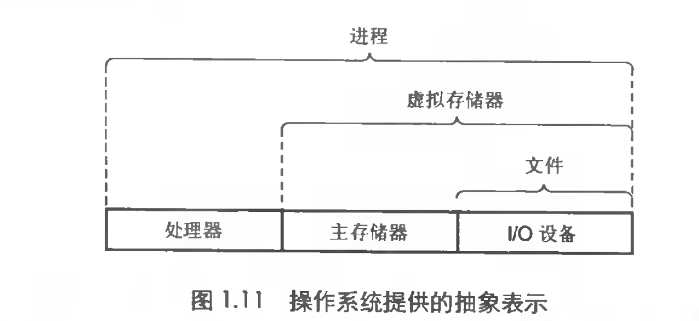

### 本周读书笔记总结

上周端午放假三天，又看了一下《深入理解操作系统》这本书两天搞明白两个问题记录一下

1. 两段代码 A：外循环循环 10次内循环循环10000次。B:外循环循环10000次内循环循环10次，两段程序那段效率更高

   ```
   A： 
   for （int i=0;i<10;i++）{
       for (int j=0;j<10000;j++)
       	K++;
       //...
       }
   }

   B:  
   for （int i=0;i<10000;i++）{
       for (int j=0;j<10;j++){
       	K++;
       //...
       }
   }

   ```

   ​

分析：

本质上A，B两段代码 时间复杂度是相同的O(n*m)，但是考虑一下局部性，一般来说代码是有局部性的包括时间局部性与空间局部性，下面看一下网上的说法

**时间局部性(temporal locality)**

时间局部性指的是：被引用过一次的存储器位置在未来会被多次引用（通常在循环中）。

**空间局部性(spatial locality)**

如果一个存储器的位置被引用，那么将来他附近的位置也会被引用。

假设A，B两段处理的内容完全相同，上下文也完全相同。计算机中高级语言转换为汇编进而转换为二进制执行的时候，对于用户角度来说就是执行一个二进制文件如：./a.out,然后启动一个进程，分配进程空间，通过内核调度cpu执行进程，这个过程中也许内存中并没有加载代码，产生缺页中断，待执行程序段加载到内存这个过程中并不是一次加载完成，中间会产生多次中断，以分页的形式不断映射如内存，同时在内存紧张的时候也会产生lru。对于cpu来说并不会直接在内存器中处理逻辑（k++），cpu通过寄存器执行指令，不停的将内存中的数据通过cpu的L1，L2，L3高速缓存载入寄存器，运算后在重新写入高速缓存，进而完成所执行的代码逻辑。

也就是说，这个过程中如果内循环循环次数比较大，它在空间局部性上也就会有更高的概率命中高速缓存或者内存，进而运行的速度更快，外循环次数越大，相对来说空间局部性也就越差命中高速缓存概率相对较低，从而产生等待，需要从更低级的缓存获取数据，速度肯定比前者要慢。

1. golong 中经典的MPG模型中，G标示协程,P标示上下文,M真正的内核线程，何为内核线程，何为用户态线程？

   一开始，总是理解为内核线程是内核线程，用户线程是用户线程。中间是N对M的关系，内核线程工作在内核空间，用户线程工作在用户空间。所以用户线程需要调度io或者内核操作的时候总是要从内核态切换到用户态。

   用书中的一张图标示一下，进程，虚拟内存，文件

   

   也就是说，不管进程还是线程都是一种资源的抽象，既然如此，何为内核态何为用户态。内核态只是当用户态线程需要执行IO或者内核操作的时候，操作系统给线程打上一个标签以标示允许进入调用内核（类似于权限一样），当调用结束的时候，重新将标签进行更改，不在允许调用内核代码。对于程序来说就是用内核态进入用户态，堆栈空间，堆还是那个堆，栈空间从用户空间切换到内核空间中了，对于cpu来说就是堆栈指针的寄存器指向变了。而从内核态出来之后有如何找到原来的用户栈呢？进入内核栈的时候记录一下用户栈的地址不就完了，内核态的操作执行完成之后，弹出用户态地址，加载到寄存器即可。

   所以如果非要说有线程或者进程的概念是一种抽象，可以理解为某一段时间片，cpu执行了某些代码而已，既然是这样，用户态与内核态也只是操作系统从系统层面考虑的一种更合适的分层，都是某段时间片cpu执行了一系列的指令，而我们是否可以理解为，这是对这个过程以及所产生的空间切换（或者权限控制）定义的一个概念。

   在说回golang 的GMP，也只是golang 自己做的一套类似于操作系统调度一样的东西，用于弱化进程与线程的概念，引入协程的抽象去托管一系列调度，轻松让用户实现高并发，配合CSP并发模型，打造一种为并发而生的语言，以非嵌入式的组合思想代替传统面向对象的强入侵式的继承，让用户能更好，更方便，更简单的通过组合去描述实体。

   #### 以上只是自己的拙见，不代表任何论点与观念，仅用于反省自己梳理自己的知识，以一种自我理解的方式记录下来，也许以后自己对某些点会有更深层的认识，但是这何尝不是我一步一步走过的脚印。